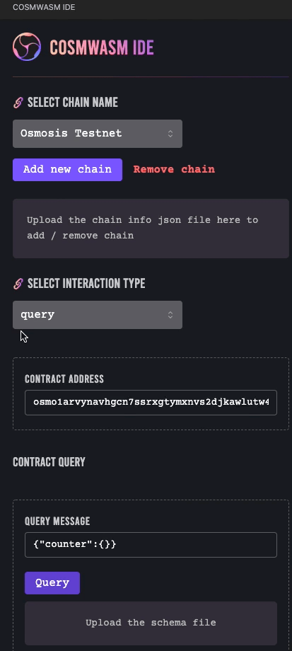

   &nbsp
  

<h1 align="center">
    CosmosWasm IDE - An open-source project for CosmWasm smart contract developers  
</h1>

## Document

This repo is the part of CosmWasmIDE, support render view CosmWasm IDE explorer. We are implement some features with explorer:

- Add and drop chain
- Input your fields of message migrate, query or execute contract.

First, We need open the `contract.rs` in the editor and then open IDE explorer with the icon in the extension bar. Select the chain you want to interact with.
Select your action (query, execute, migrate)
Enter your `json message` and press the button

Please refer to the official CosmWasm IDE documentation which includes all repos related to it:

- [Official CosmWasm IDE documentation](https://github.com/oraichain/cw-ide-docs)

## Contributing

Please read [CONTRIBUTING.md](CONTRIBUTING.md) for details on our code of conduct, and the process for submitting pull requests to us.
